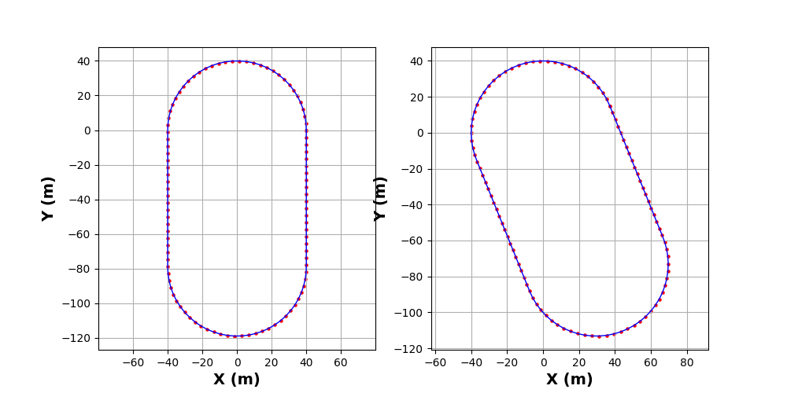

# CSU-Playground-Coords
一段有关生成轨迹坐标点（GCJ-02 坐标系）的代码。
# 说明
此处以中南大学新校区体育场副田径场为例：

1. 以上侧（北方）的弧（此处当作半圆）的圆心为基准点，该点坐标为 (112.927251362, 28.160720451)；
2. 基准点南偏东 22°（方位角为 158°），距离 79 米的点为下侧半圆的圆心;
3. 两圆半径均为 40 米；
4. 左右两侧作两圆公共切线为直道。

# 生成流程

1. 以基准点为 (0, 0) 点为坐标原点，绘制操场形状并离散得到各点的相对坐标 `points` ；
2. 将相对坐标 `points` 映射到 WGS-84 坐标系，得到 `coords` ;
3. 将 `coords` 映射到 GCJ-02 坐标系得到最终的 `gcj_coords` 。

